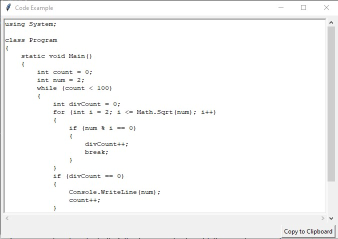

# chat_agent

## About

This is building a conversational AI agent, integrating ideas about autonomous agents and 
[ReAct](https://react-lm.github.io/). It can take complex or even vague tasks, and use external tools to accomplish it using logical steps.

The ultimate goal is to have a friendly, empathic, and helpful
virtual assistant that can run in the background as one works. 

It's primary modality is intended to use
voice, with the ability to also display useful information on one's screen. For example, if the agent
has performed an online search and summarizes the information it found, it can also provide you
with the relevant URLs it consulted and, on request, open one or more of the links in your local
browser for further perusal. It can even chain these steps together, such as in:

```
AI: Hello Karen! How can I assist you today?

Human: can you find and open for me documentation on the python random library

AI: Thought: Karen is asking for documentation on the Python random library. I will need to search for this online.

AI: Thought: I have found the documentation for the Python random library. I will now open the link for Karen.

[the agent opens the link on Karen's browser]

AI: I have accomplished your task of finding and opening the documentation for the Python random library. You should now be able to see the documentation in your browser. Is there anything else you need help with, Karen?
```

The agent is designed to allow various external tools to be built, following some basic guidelines, and more or less
simply plugged in by registering them in a JSON configuration file. On start up, the agent uses that configuration file
to initialize each tool and make them available in the system prompt to the LLM (currently it works best with OpenAI's
GPT-4, though I am investigating using other open source LLMs, ideally free).

This repository also includes a rudimentary chatbot that uses the chat agent, to allow demonstration and testing. It allows both text (via STDIO) as well as voice interface.

## Want to play with it?

This is a development project, so the best thing would do is to download or clone this repository. E.g.,

```
1) git clone https://github.com/karencfisher/chat_agent.git

2) cd chat_agent

2) create a virtual environment, and activate it (Conda, venv, etc.)

3) pip install -f requirements.txt
```

You will need to make a .env file to contain your API keys. Here is a template:

```
OPENAI_API_KEY = <your openai API key>
GOOGLE_API_KEY = <your Google API key>
GOOGLE_CSE_ID = <your Google custom search enine>
PALM_API_KEY = <your Google PaLM API key>
```

For how to setup Google Programmable Search Engine, get API key, CSE, etc, click [here](https://developers.google.com/custom-search/v1/overview)

To setup OpenAI API use, and get an API key [start here](https://platform.openai.com/)

For Google PaLM 2 API, [start here](https://developers.generativeai.google/) (Has not worked yet with the chat agent, however.)

You will also want to make your own user_profile.txt file (in the chat_agent sub-directory). This, for example, allows you to ask for local information without including the location. Here is a template, Make it as complete as you want, but I'd include at least your name and your location. 

```
name: your name
location: where you are
```

With all that done, you should be good to go. To run the chat_bot, at the project root, run

```
python chat_bot.py
```

If you want to talk instead of typing, instead run

```
python chat_bot.py voice
```

Oh, BTW -- the name of the agent is Susan. If you want to change that, you can edit it in the chat_agent/sys_prompt.txt file. In that file is the prompt engineering for the LLM. "Prompting is the new coding," one may say. 

### Configuration, and costs

The default configuration (chat_agent/chat_config.json) is set up for OpenAI, and the GPT-4 model, as it handles instructions  best. However, it is pricier (i.e., $0.03/thousand input tokens, and $0.06/thousand output tokens). As the context (input to the model) grows as you chat (up to 8k tokens), it can add up. A single user prompt and model response, after a while, might cost around $0.30, for example. If using tools, including search, the cost can be more, as behind the scenes the agent will also call the LLM for intermittent steps, including having it summarize search results. As much as $1.20 or so.

OpenAI's chat-3.5.turbo model is cheaper ($0.0015/thousend input tokens, $0.002/thousand output.) However, it is less instructable -- it might, for example, not heed the system prompt and thus not even use the search tool. Instead, it will just hallucinate.

I am working on integrating open source/free LLMs as alternative back ends, but so far none follow instructions as well as GPT-4 does. So far PaLM 2 ignores my instructions and merrily does its own thing, for example. Similarly GPT4All (besides, on my puny local machine it can be painfully slow).

Also, in any case, currently I am using OpenAI's embedding model (Ada v2) to embed documents as part of the Google search tool. Those cost $0.0001/thousand tokens. (You will need an OpanAI API key, even if you are experimenting with other LLMs. I plan to migrate this to an open source/free sentence embedding model in the future).

## Google Search Tool

The search tool I have here is pretty intensive. 

1) Given a query, it uses Google's programmable search engine to find 10 (by default) pages.

2) Ansynchronously, it requests each page. If successful, it scrapes the text from the page. It then splits the text into chunks (documents), vectorizes them, and stores them in an FAISS vector database (in RAM). The original URLs are also stored with the documents as metadata.

3) Using the same query, it peforms semantic search on the vector DB. It finds (by default) the best 5 matching documents (chunks). It also gathers the relevant URLs from the document metadata.

4) The relevant documents are then summarized by the LLM. 

5) The LLM is then prompted with this summary and the URLs as "observations," along with the original question, to write a final answer.

The vector DB retains any pages it visits throughout the session. This way, if you ask a follow up question addressable by the previous search results, it will not need to initiate a new search. It can use the cached data.

You can also, if you like, readily then ask the AI for the links it consulted, and then have it open one or more in your default browser. E.g.

```
Human: what is the forecast for today?

AI: Thought: I will need to look up the weather forecast today, for Moab, Utah. This will take a moment.


AI: Thought: I have accomplished the task of finding the weather forecast for today in Moab, Utah.


AI: The weather in Moab, Utah today is expected to be partly cloudy with high temperatures ranging from 104�F to 108�F. The lowest temperature is expected to be around 72�F to 75�F. The wind speed will vary from 12 MPH to 16 MPH, with gusts as high as 22 MPH. The UV index is expected to be very high at 10. There is no chance of rain, the humidity is expected to be around 14%, and the visibility is expected to be 10 miles.

Human: What are the resources you consulted?

AI: Thought: I will provide the links to the resources I consulted for the weather forecast.

AI: Here are the resources I consulted for the weather forecast:

1. [Moab Weather Forecast and Reports (84532)](https://www.weatherforyou.com/report/moab-ut)
2. [Moab UT hourly weather forecast - LocalConditions.com](https://www.localconditions.com/weather-moab-utah/84532/hourly.php)
3. [Moab, UT 10-Day Weather Forecast - The Weather Channel](https://weather.com/weather/tenday/l/Moab+UT?canonicalCityId=5567d7ca1c71ad5657f8d83d032092d58f42063b90cb6effc3891129b917991d)
4. [Moab, UT Weather Forecast and Conditions - The Weather Channel](https://weather.com/weather/today/l/Moab+UT?canonicalCityId=5567d7ca1c71ad5657f8d83d032092d58f42063b90cb6effc3891129b917991d)
5. [7-Day Forecast 38.56N 109.55W](https://forecast.weather.gov/MapClick.php?lat=38.573270000000036&lon=-109.54965999999996)

Human: Open the first one for me.

AI: Thought: I will open the first link for the user.

[The agent opens the link on my browser]

AI: Thought: I have accomplished the task of opening the link.

AI: I have opened the link to "Moab Weather Forecast and Reports (84532)" for you.

```


Or, if you prefer, you can make one prompt to chain the two tasks together, as in the example earlier above. ("Find and display ...")

## Code examples

A popular use for LLMs has become having them writing code. This can be educational and as well useful to save time working on development projects.

For code written for us by the AI, it is filtered out from the final respones and is displayed in a popup window. From there one can copy the code to paste into their IDE, for example, to test, tweak, extend, learn from, etc. For example, asked to write a C++ program to calculate the first 100 prime numbers, the agent displays it. This will prevent the chat bot from reciting a bunch of code outloud, if in voice mode!



The agent will also, in this example, respond directly to the user with

```
AI: Here's a simple C# program that calculates the first 100 prime numbers:

<Displayed>

This program uses a while loop to keep generating numbers until we have found 100 prime numbers. For each number, it checks if it is divisible by any number up to its square root (since a larger factor of the number would be a multiple of smaller factor that has already been checked). If it finds a divisor, it breaks out of the loop and moves on to the next number. If no divisors are found, it prints the number and increments the count of prime numbers found.
```

## Inspirations

I am inspired by
frameworks such as [LangChain](https://python.langchain.com/docs/get_started/introduction.html)
and Marc Päpper's (much simpler) [LLM-agents](https://github.com/mpaepper/llm_agents).
My approach is somewhere between the two, as it is more specific than an extensive framework such as LangChain,
but more complete than LLM-agents. It is also indirectly inspired by 
[BabyAGI](https://github.com/yoheinakajima/babyagi), though at present I am taking 
different approach in that the steps for a task are determined step by step, a posteriori as it were.


